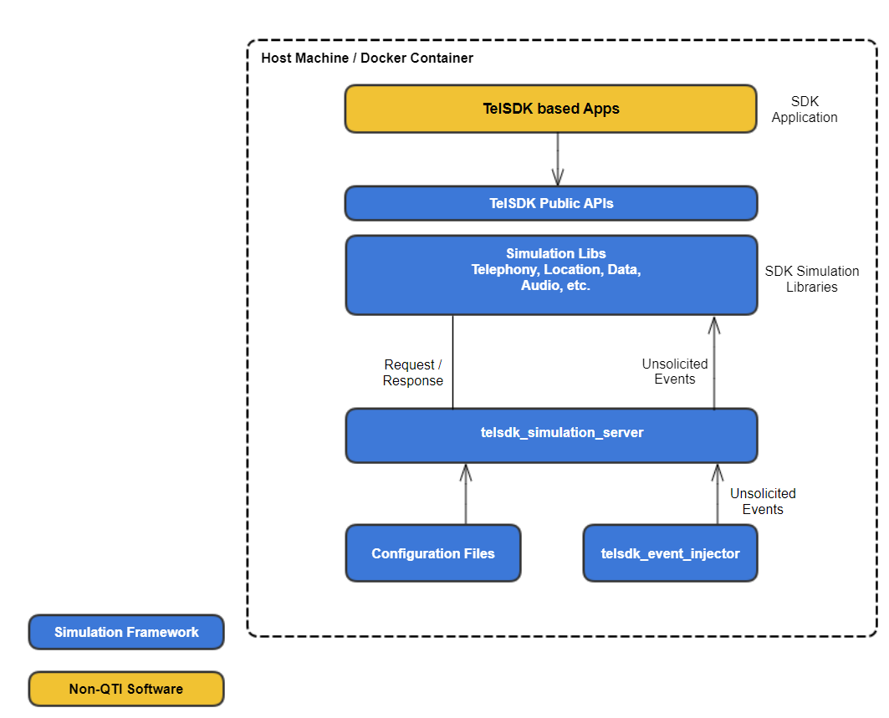
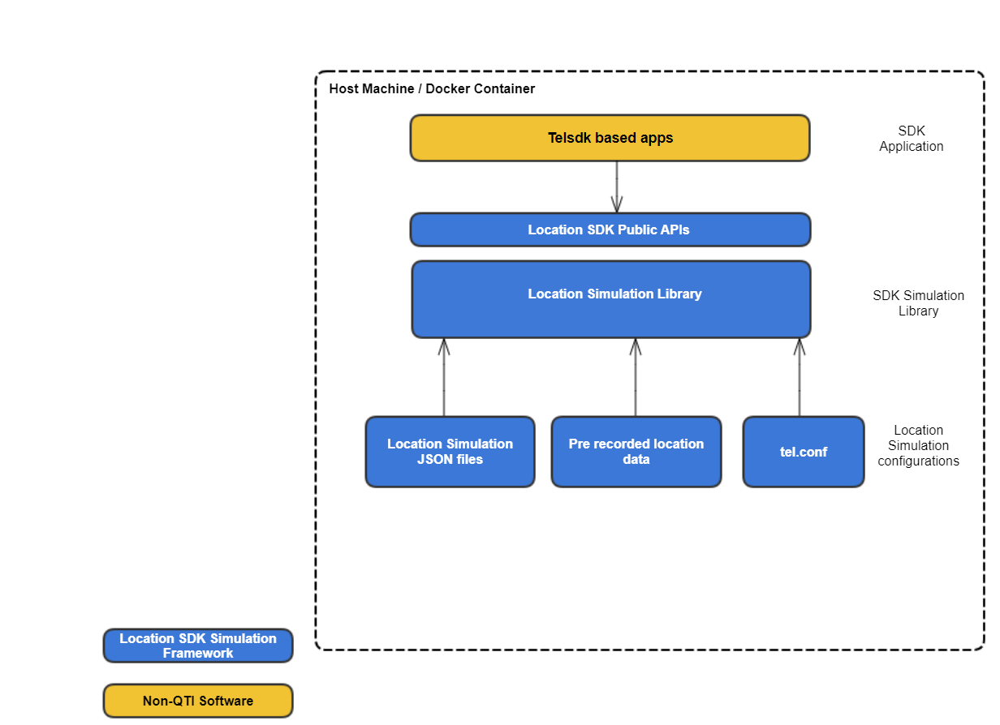
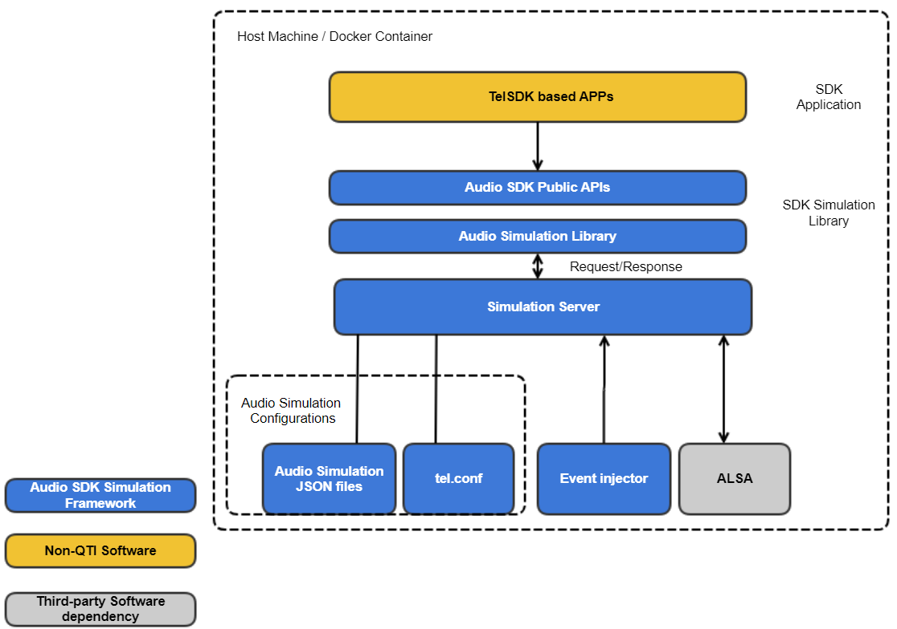
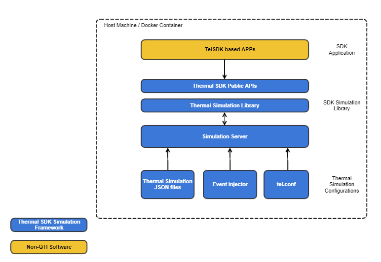
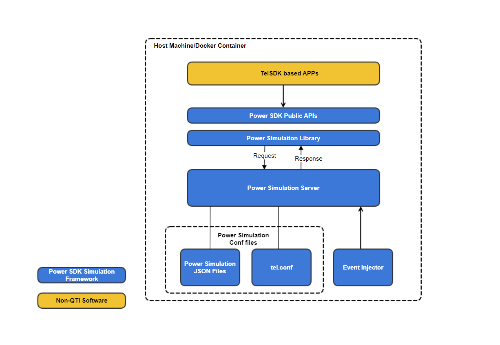
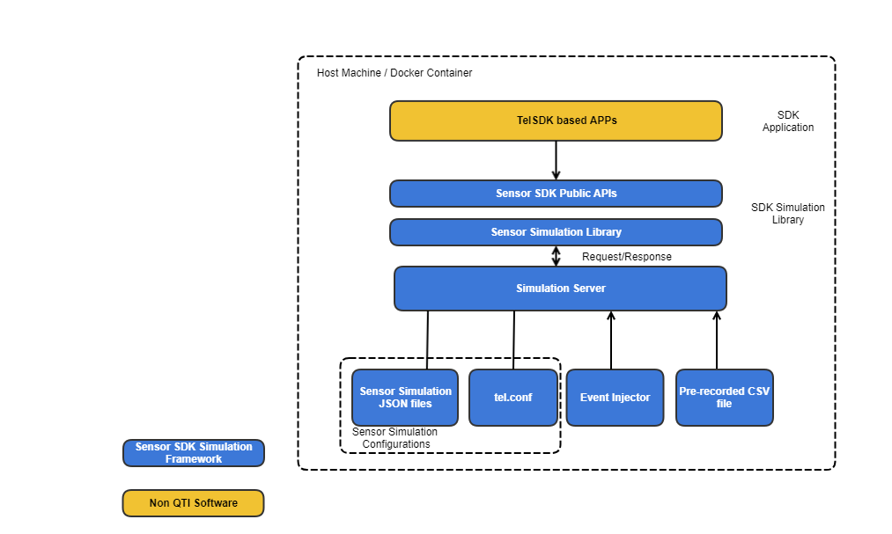
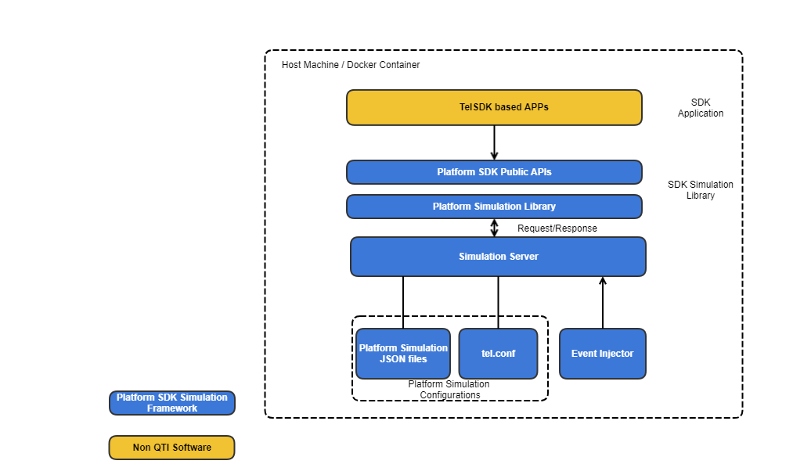

.. #=============================================================================
   #
   #  Copyright (c) 2024-2025 Qualcomm Innovation Center, Inc. All rights reserved.
   #  SPDX-License-Identifier: BSD-3-Clause-Clear
   #
   #=============================================================================

=======================
Simulation with TelSDK
=======================

TelSDK simulation enables development of applications using the SDK's APIs on any Linux based hardware. The simulation is intended to enable software development, even before the actual Telematics hardware is available. Users can run the simulation on a Linux desktop if they choose.

The Simulation framework provides libraries which are compile time equivalent to the actual concrete libraries. The simulation libraries provide the behavior of APIs similar to the behavior seen on an actual Telematics device with the concrete libraries.

This allows applications to be developed, compiled, and executed using this framework. An application can link to the simulation libraries to use the functionality of the SDK APIs in this framework. The same application can then be recompiled for the target Telematics device without requiring any redevelopment or code changes.

The Simulation framework is designed to be configurable to tweak the behavior and the responses of the APIs. This provides flexibility to exercise the client code in multiple ways and scenarios.
Users can run the Simulation framework within a docker as well if desired.

.. _telsdk-ontarget-arch :
.. figure:: ../../images/telsdk_overview.png
  :width: 500

  TelSDK On-Target Architecture

.. _telsdk-simulation-arch :

  TelSDK Simulation Architecture

---------------------------------------
Components of the simulation framework
---------------------------------------

This section provides an overview of the components involved in the TelSDK simulation framework.

SDK Simulation Libraries
~~~~~~~~~~~~~~~~~~~~~~~~~

The telematics simulation library runs in the user space of the Linux system. It interacts with the simulation server and other subsystems to provide various services like phone calls, SMS, etc. These services are exposed by the SDK through the same fixed public APIs that are available on all Telematics platforms that support SDK.

Simulation Server
~~~~~~~~~~~~~~~~~

This is the main daemon that interacts with all the clients using the Simulation framework and provides the functionality for all the public APIs.

Event Injector
~~~~~~~~~~~~~~

Event injector allows the users to inject unsolicited events. It is a Linux based command-line utility that injects events into the simulation framework. For example: ``telsdk_event_injector -f tel_card -e cardInfoChanged <slotId> <cardPower> <isNtnProfileActive>`` could be triggered to change the card power state or Non-terrestrial networks(NTN) profile active status.

Syntax for injecting events: ``telsdk_event_injector -f <filter/subsystem/manager> -e <event> <arguments>``

* ``-f``: specifies the filter.
* ``-e``: specifies the event that is triggered.

**To get help related to the events supported by TelSDK simulation**

* ``telsdk_event_injector -h``: provides the list of subsystems for which events are available.
* ``telsdk_event_injector -h <subsystem>``: provides the list of supported events in that particular subsystem.
* ``telsdk_event_injector -h <subsystem> <event>``: provides detailed information ,i.e., the syntax and arguments for that event.

--------------------------------
Getting started with simulation
--------------------------------

Build steps
~~~~~~~~~~~~

To build various components of the Simulation framework:

1. Fetch the source code

.. code-block::

  $ git clone https://git.codelinaro.org/clo/le/platform/vendor/qcom-opensource/snaptel-sdk.git -b telsdk.lnx.2.0.r11-rel telux
  $ cd telux/

2. Set up Build dependencies

.. code-block::

  #Install jsoncpp, cmake 3.15.3, gRPC.
  $ ./build_sim.sh setup <DESTINATION_FOLDER_ROOT_PATH>

3. Build simulation libraries, TelSDK sample apps, and test apps

.. code-block::

  $ ./build_sim.sh all <DESTINATION_FOLDER_ROOT_PATH>

**Note:** All the required TelSDK simulation include files, libs, and binaries get installed in <DESTINATION_FOLDER_ROOT_PATH>

4. Export path

.. code-block::

  $ source <DESTINATION_FOLDER_ROOT_PATH>/bin/setup_simulation.sh

The above script would setup different environment variables like ``PATH, LD_LIBRARY_PATH, PKG_CONFIG_PATH, CC, CXX``, etc.

5. To perform a build for user applications using cmake

.. code-block::

  $ cmake -DCMAKE_CXX_STANDARD_INCLUDE_DIRECTORIES=<DESTINATION_FOLDER_ROOT_PATH>/include -DCMAKE_INSTALL_PREFIX=<DESTINATION_FOLDER_ROOT_PATH> <APPS_CMAKE_PATH> && make install

Run apps with docker
~~~~~~~~~~~~~~~~~~~~~

To run applications within the docker container:

1. Install docker

  .. code-block::

    $ sudo apt update
    $ sudo apt install apt-transport-https ca-certificates curl software-properties-common
    $ curl -fsSL https://download.docker.com/linux/ubuntu/gpg | sudo apt-key add -
    $ sudo add-apt-repository "deb [arch=amd64] https://download.docker.com/linux/ubuntu bionic stable"
    $ sudo apt update
    $ sudo apt install docker-ce

  Once the installation is complete, we recommend that users do the following to add a docker affiliation group for the current user. This will make it easier to develop and avoid typing the "sudo" prefix every time.

  .. code-block::

    $ sudo usermod -aG docker ${USER}

2. Build docker image

  .. code-block::

    $ cd telux/
    $ ./build_sim.sh docker-image <DESTINATION_FOLDER_ROOT_PATH>

3. Run docker container

  .. code-block::

    $ docker run -ti --rm -h telsdk_simulation -v telsdk_volume:/data/telux telsdk-sim-image

4. User application can be started or if users wish to run one of the SDK's sample app or test app within the docker, then

  .. code-block::

    $ <APP_NAME>

  **Note:**

  1. The docker image built will have user application binaries installed to the docker container ``/usr/bin/`` path.
  2. When the docker container is started, it automatically starts the simulation server in the background.
  3. The path ``/data/telux/`` holds all TelSDK simulation related data.
  4. We are making use of the docker volume, to make this folder ``/data/telux`` persistent across multiple boots of the docker.
  5. To reset the persistent data, delete the docker volume.

Run apps without docker
~~~~~~~~~~~~~~~~~~~~~~~~

To run applications without the docker container:

1. Export path, if not already done

  .. code-block::

    $ source <DESTINATION_FOLDER_ROOT_PATH>/bin/setup_simulation.sh

2. Start simulation server in the background

  .. code-block::

    $ telsdk_simulation_server &

3. User application can be started or if users wish to run one of the SDK's sample app or test app, then

  .. code-block::

    $ <APP_NAME>

  **Note:**

  1. In the host machine, application binaries are installed to the ``<DESTINATION_FOLDER_ROOT_PATH>/bin/``
  2. The path ``<DESTINATION_FOLDER_ROOT_PATH>/data/telux/`` holds all TelSDK simulation related data.
  3. The path ``<DESTINATION_FOLDER_ROOT_PATH>/etc/telux/tel.conf`` holds TelSDK simulation configuration data.

Build and run inside docker
~~~~~~~~~~~~~~~~~~~~~~~~~~~~~

To build various components of the Simulation framework inside docker

1. Fetch the source code

  .. code-block::

    $ git clone https://git.codelinaro.org/clo/le/platform/vendor/qcom-opensource/snaptel-sdk.git -b telsdk.lnx.2.0.r11-rel telux
    $ cd telux/

2. Build docker development image

  .. code-block::

    $ cd telux/
    $ ./build_sim.sh docker-development-image <DESTINATION_FOLDER_ROOT_PATH>

    **Note:**
    1. To build a Docker development image for an Ubuntu version different from the host machine, set the UBUNTU_VERSION variable before running the script.
    2. For build inside the docker, the DESTINATION_FOLDER_ROOT_PATH can be set to the root directory. For example: ./build_sim.sh all /
    3. If the host machine is running version 18.04, and Ubuntu 22.04 docker image needs to be created, set the UBUNTU_VERSION variable to 2204
    4. Currently supported: Ubuntu 18.04, Ubuntu 20.04 and Ubunt 22.04

3. Run docker container
  .. code-block::

    $ docker run -ti --rm -h telsdk_simulation -v <host-machine-dir>:<docker-contatiner-dir> telsdk-sim-image-develop

    For example:
    docker run -ti --rm -h telsdk_simulation -v $PWD:/home/docker telsdk-sim-image-develop

4. Set up build dependencies

.. code-block::

  #Install jsoncpp, cmake 3.15.3, gRPC.
  $ ./build_sim.sh setup <DESTINATION_FOLDER_ROOT_PATH>

5. Build simulation libraries, TelSDK sample apps, and test apps

.. code-block::

  $ ./build_sim.sh all <DESTINATION_FOLDER_ROOT_PATH>

**Note:** All the required TelSDK simulation include files, libs, and binaries get installed in <DESTINATION_FOLDER_ROOT_PATH>

6. Export path

.. code-block::

  $ source <DESTINATION_FOLDER_ROOT_PATH>/bin/setup_simulation.sh

The above script would setup different environment variables like ``PATH, LD_LIBRARY_PATH, PKG_CONFIG_PATH, CC, CXX``, etc.

7. To perform a build for user applications using cmake

.. code-block::

  $ cmake -DCMAKE_CXX_STANDARD_INCLUDE_DIRECTORIES=<DESTINATION_FOLDER_ROOT_PATH>/include -DCMAKE_INSTALL_PREFIX=<DESTINATION_FOLDER_ROOT_PATH> <APPS_CMAKE_PATH> && make install

To run the application inside docker:

1. Export path, if not already done

  .. code-block::

    $ source <DESTINATION_FOLDER_ROOT_PATH>/bin/setup_simulation.sh

2. Start simulation server in the background

  .. code-block::

    $ telsdk_simulation_server &

3. User application can be started or if users wish to run one of the SDK's sample app or test app, then

  .. code-block::

    $ <APP_NAME>

---------------------------------------
Configuring behavior of the simulation
---------------------------------------

Managing subsystem readiness or service availability
~~~~~~~~~~~~~~~~~~~~~~~~~~~~~~~~~~~~~~~~~~~~~~~~~~~~~

TelSDK initializes various subsystems during startup. It marks each subsystem as ready once the initialization procedures are completed for that subsystem. The application must wait until the corresponding subsystem on which it needs to make API requests is ready. TelSDK provides APIs to check whether a subsystem is ready or not.

The Simulation framework simulates subsystem readiness. The behavior and timing of this can be configured via the API specific JSON file. These user configurable JSON files are located under the path ``/data/telux/json/api/`` and the name of the JSON file corresponds to the subsystem name specified in the public headers.

For example: IDataConnectionManager.json present in ``/data/telux/json/api/``

+------------------+---------------------------------------+
|  JSON attribute  |  Description                          |
+==================+=======================================+
|  IsSubsystem     |  Specifies the subsystem readiness.   |
|  Ready           |                                       |
+------------------+---------------------------------------+
|  IsSubsystem     |  Specifies time the simulation        |
|  ReadyDelay      |  framework should take to indicate    |
|                  |  subsystem readiness)                 |
|                  |                                       |
+------------------+---------------------------------------+

Response Management
~~~~~~~~~~~~~~~~~~~~

TelSDK simulation framework allows simulating each API response via updating the API specific JSON file.
The table shows the JSON attributes to modify the behavior of the API in simulation.

+------------------+------------------------------------------------+
|  JSON attribute  |  Description                                   |
+==================+================================================+
|  Default         |  For all the public APIs this delay would be   |
|  CallbackDelay   |  the default delay and would only be           |
|                  |  considered if callbackDelay is not specified. |
|                  |                                                |
+------------------+------------------------------------------------+
|  status          |  Specifies the immediate synchronous           |
|                  |  response that application would receive when  |
|                  |  the TelSDK API is invoked. It is usually the  |
|                  |  return status of the API invoked.             |
|                  |                                                |
+------------------+------------------------------------------------+
|  callbackDelay   |  Specifies the time that simulation libraries  |
|                  |  shall take before invoking the callback       |
|                  |  function and -1 could be configured to avoid  |
|                  |  callback invocation. This would be given      |
|                  |  preference over DefaultCallbackDelay          |
|                  |                                                |
+------------------+------------------------------------------------+
|  error           |  Specifies ErrorCode that will be sent along   |
|                  |  with the user provided callback function.     |
|                  |                                                |
+------------------+------------------------------------------------+

The JSON for API behavior could be updated dynamically by making use of the json_update script.

For example: Considering the below API entry in JSON

.. code-block::

  "getDefaultProfile": {
  "callbackDelay": 400,
  "error": "SUCCESS",
  "status": "SUCCESS"
  },

.. code-block::

 $ json_update /api/data/IDataConnectionManager.json IDataConnectionManager getDefaultProfile callbackDelay 300

Above would update callbackDelay to 300.

**Note:** There will be cases where additional fields in response management would be needed. For example: SMS management.

Sending external events
~~~~~~~~~~~~~~~~~~~~~~~~

TelSDK simulation framework lets users simulate certain system level behaviors by injecting unsolicited event using event injector.
Use the event injector helper option to get detailed information about the events supported by each subsystem.

Multi-SIM configuration
~~~~~~~~~~~~~~~~~~~~~~~~

MULTISIM_CONFIG in ``etc/telux/tel.conf`` specifies type of multi-SIM configuration supported. By default, multi-SIM configuration is not enabled.

RPC port configuration
~~~~~~~~~~~~~~~~~~~~~~~~

Default configuration uses 8089 for communication between simulation server & its clients. If needed, ``RPC_PORT`` can be updated in tel.conf.

---------------------
Data and state usage
---------------------

The data stored and used by the simulation can be classified into three categories as mentioned below:

* **API response data:** Specifies API responses as described in the section *Response Management* above. For example: synchronous response or asynchronous response. JSON files under the path ``/data/telux/json/api/`` hold the API responses. Users can modify this file to change the value returned in the response.
* **Static system data:** Specifies static persistent data. For example: IMEI number, thermal zone information, etc. JSON files under the path ``/data/telux/json/system-info/`` hold the system static data. It is used internally by our TelSDK simulation libraries to maintain system states and shall not be altered externally.
* **Dynamic system data:** Specifies dynamic persistent data. For example: RAT preference, VLAN configuration, Backhaul configuration, etc. JSON files under the path ``/data/telux/json/system-state/`` hold the system state. It is used internally by our TelSDK simulation libraries to maintain system states and shall not be altered externally.

----------------------
Logging in simulation
----------------------

TelSDK simulation framework supports logging. User configurable logger settings available in ``/etc/telux/tel.conf`` are listed below.

+------------------+-----------------------------------------------------------------+
|  LOGGER_LEVEL    |  Supported log levels are:                                      |
|                  |                                                                 |
|                  |  NONE -- No logging.                                            |
|                  |                                                                 |
|                  |  PERF -- Prints messages with nanoseconds precision timestamp.  |
|                  |                                                                 |
|                  |  ERROR -- Very minimal logging. Prints error messages only.     |
|                  |                                                                 |
|                  |  WARNING -- Prints perf, error and warning messages.            |
|                  |                                                                 |
|                  |  INFO -- Prints errors, warning, and information messages.      |
|                  |                                                                 |
|                  |  DEBUG -- Full logging including debug messages.                |
|                  |  It is intended for debugging purposes only.                    |
|                  |                                                                 |
+------------------+-----------------------------------------------------------------+
|  LOGGER_TYPE     |  Supported log types are:                                       |
|                  |                                                                 |
|                  |  CONSOLE_LOG -- enables console logging                         |
|                  |                                                                 |
|                  |  FILE_LOG -- enables file-based logging. Once file logging is   |
|                  |  enabled,LOG_FILE_NAME and LOG_FILE_PATH could further be       |
|                  |  configured by users                                            |
|                  |                                                                 |
|                  |  SYSLOG_LOG -- enables syslog logging.                          |
|                  |                                                                 |
+------------------+-----------------------------------------------------------------+

---------------------------
Environment specifications
---------------------------
Current release has been tested with the combination below.

* Ubuntu 18.04
* gcc version 7.5.0
* ldd version 2.27

----------------------------------------
Simulation under different technologies
----------------------------------------

The details on how simulation of individual areas can be used and controlled are available below.

1. :ref:`sim-reference-telephony`
2. :ref:`sim-reference-location`
3. :ref:`sim-reference-audio`
4. :ref:`sim-reference-data`
5. :ref:`sim-reference-thermal`
6. :ref:`sim-reference-power`
7. :ref:`sim-reference-sensor`
8. :ref:`sim-reference-platform`

.. _sim-reference-telephony:

Telephony Simulation
~~~~~~~~~~~~~~~~~~~~~

Overview of Telephony Simulation
"""""""""""""""""""""""""""""""""

This page and the sub-pages provide information about usage of simulation for the telephony
sub-system that are part of the telux::tel namespace of the Telematics SDK.

.. _fig-tel-sim-overview:
.. figure:: ../../images/simulation_telephony_overview.png
  :width: 500

  Telephony Simulation Framework

APIs supported by the Simulation framework
"""""""""""""""""""""""""""""""""""""""""""

| -SMS: ISmsManager,ISmsListener, ISmscAddressCallback, SmsMessage
| -Card: ICardApp, ICardFileHandler, ICardManager, ICardListener, ICard
| -Subscription: ISubscriptionManager, ISubscriptionListener, ISubscription
| -Phone: IPhoneManager, IPhone
| -Call: ICallManager, ICallListener, ICall
| -ServingSystem: IServingSystemManager, IServingSystemListener

Telephony APIs Response handling
"""""""""""""""""""""""""""""""""

SMS
''''

The framework allows responses to each API to be configured using a JSON file.
Each manager has its own JSON configuration file present under ``simulation/json/api/tel/``

Example for API command response for telux::tel::ISmsManager::SendSms

.. code-block::

  "SendSms" :
      [
          {   "numberOfSegments" : 2,
              "status" : "SUCCESS"
          },
          {
              "smsResponseCbErrorCode" : "SUCCESS",
              "smsResponseCbDelay" : 9000,
              "smsResponseCbMsgRefs" : "1 2"
          },
          {
              "onDeliveryReportErrorCode" : "SUCCESS",
              "onDeliveryReportMsgRef" : 1,
              "onDeliveryReportCallbackDelay" : 12000
          },
          {
              "onDeliveryReportErrorCode" : "SUCCESS",
              "onDeliveryReportMsgRef" : 2,
              "onDeliveryReportCallbackDelay" : 12000
          }
      ]

Here, clients are expected to provide the inputs for JSON attributes of API according to an encoded message.

The table explains the configuration for API response parameters of *simulation/json/api/tel/ISmsManagerSlot1.json and simulation/json/api/tel/ISmsManagerSlot2.json*

+----------------------------------+------------------------------------------------------------+
|  JSON attribute                  |  Description                                               |
+==================================+============================================================+
|  numberOfSegments                |  Signifies number of segments present in encoded message.  |
|                                  |                                                            |
+----------------------------------+------------------------------------------------------------+
|  status                          |  Status of request.                                        |
|                                  |                                                            |
+----------------------------------+------------------------------------------------------------+
|  sentCallbackErrorCode,          |  Response callback errorcode.                              |
|  smsResponseCbErrorCode          |                                                            |
+----------------------------------+------------------------------------------------------------+
|  sentCallbackDelay,              |  Response callback delay.                                  |
|  smsResponseCbDelay              |                                                            |
+----------------------------------+------------------------------------------------------------+
|  sentCallbackMsgRefs,            |  Add reference number for every message segment according  |
|  smsResponseCbMsgRefs            |  to numberOfSegments with one space between the digits.    |
+----------------------------------+------------------------------------------------------------+
|  deliveryCallbackErrorCode       |  Delivery report for individual segment is invoked using   |
|                                  |  delivery callback error                                   |
+----------------------------------+------------------------------------------------------------+
|  deliveryCallbackDelay,          |  Delivery report for individual segment is invoked using   |
|  onDeliveryReportCallbackDelay   |  delivery callback delay.                                  |
+----------------------------------+------------------------------------------------------------+
|  onDeliveryReportErrorCode       |  Delivery callback errorcode.                              |
|                                  |                                                            |
+----------------------------------+------------------------------------------------------------+
|  onDeliveryReportMsgRef          |  Delivery report for message reference of a segment.       |
|                                  |                                                            |
+----------------------------------+------------------------------------------------------------+
|  receiverAddress                 |  Input receiver address according to encoded pdu.          |
|                                  |                                                            |
+----------------------------------+------------------------------------------------------------+

Call
'''''

Currently the simulation framework supports outgoing, incoming voice calls and regulatory ECalls.It provides the flexibility to configure ECall HLAP timer failures maintained by NAD device.
Support for conference calls will be added in upcoming releases.

Details of parameters that can be configured in the Simulation framework.

- "configureFailureForRegulatoryECall" : To configure ECall HLAP timer expiry.

  Supported Values: SUCCESS, T5FAILED, T6FAILED , T7FAILED.

 -SUCCESS: Successful behavior during an eCall.

 -T5FAILED: This configuration would lead to expiry of T5 timer. The simulation framework depicts that SEND-MSD signal is not decoded successfully by PSAP so it shall terminate eCall specific behaviour (i.e. it shall not proceed with the sending of MSD data).

  When it is configured, T5 timer's timeout is set to 5 sec as per EN 16062:2015.

 -T6FAILED: This configuration would lead to expiry of T6 timer. The simulation framework depicts that AL-ACK message is not recieved by IVS-NAD so it shall mark the transfer of the MSD as unsuccessful and terminate eCall specific behaviour.

   When it is configured, T6 timer's timeout is set to 5 sec as per EN 16062:2015.

 -T7FAILED: This configuration would lead to expiry of T7 timer. The simulation framework depicts that LL-ACK message is not recieved by IVS-NAD so it shall mark the transfer of the MSD as unsuccessful and terminate eCall specific behaviour.

   Timer can be configured using telux::tel::ICallManager::getECallConfig(EcallConfig::t7Timer).

- "eCallType" : To configure service domain for regulatory ECall.

  Supported Values: NGeCall , CSeCall.

- "configureECallRedialFailure" : To configure redial failures for regulatory ECall.

  Supported Values: SUCCESS, CALLORIG, CALLDROP.

These parameters can be configured via *simulation/json/api/tel/ICallManagerSlot1.json and simulation/json/api/tel/ICallManagerSlot2.json*.

Retrieve eCall MSD payload or encoded optional additional data content
''''''''''''''''''''''''''''''''''''''''''''''''''''''''''''''''''''''
To simulate retrieval of eCall MSD payload or optional additional data content, msdsettings.txt is copied to the application(ecall_app) launching path in "out/bin/". To modify MSD information, goto "out/bin/" and edit msdsettings.txt file.

Telephony data handling
""""""""""""""""""""""""

Card
'''''

Details of parameters currently configured in the Simulation framework to perform pin operations.

* "Pin1password" : "1234"  -- Password for PIN1 operations for public APIs changeCardPassword, unlockCardByPin, changeCardPassword.
* "Pin2password" : "5678" -- Password for PIN2 operations for public API changeCardPassword, unlockCardByPin, changeCardPassword.
* "Puk1password" : 11111111 -- Password for puk1 for public API unlockCardByPuk.
* "Puk2password" : 22222222 -- Password for puk2 for public API unlockCardByPuk.

file: ``simulation/json/system-state/tel/ICardManagerStateSlot1.json and simulation/json/system-state/tel/ICardManagerStateSlot2.json``

**Details of supported apps, EF files, and records**

All the EF files are considered to be present at same file structure directory of simulated SIM files.

User input for filepaths provided using APIs present under telux::tel::ICardFileHandler is not validated in the simulation library.

.. table:: ADF files

  +------------------------------------+-------------+------------------------------+--------------------------------------+
  | AppId                              | AppType     | Transparent EFs              | Linear Fixed EFs                     |
  +====================================+=============+==============================+======================================+
  |  a0000000871004f310ffff89080000ff  |  ISIM       |  File Id 1234, 5648          |  File Id 1234 , No of records 3      |
  |                                    |             |                              |                                      |
  +------------------------------------+-------------+------------------------------+--------------------------------------+
  |  a000000063504b43532d3135          |  Unknown    |  No files present            |  File Id 1234 , No of records 3      |
  |                                    |             |                              |                                      |
  +------------------------------------+-------------+------------------------------+--------------------------------------+
  |  a0000000871002fffff00189000001ff  |  USIM       |  File Id 1234, 5648, 7777    |  | File Id 1234 , No of records 3    |
  |                                    |             |                              |  | File Id 5678 , No of records 1    |
  |                                    |             |                              |  | File Id 7676 , No of records 4    |
  +------------------------------------+-------------+------------------------------+--------------------------------------+

.. table:: DF files

  +------------------------------+------------------------------------+
  | Transparent EFs              | Linear Fixed EFs                   |
  +==============================+====================================+
  |  File Id 3456 , File Id 5666 | | File Id 1234 , No of records 3   |
  |                              | | File Id 5678 , No of records 1   |
  +------------------------------+------------------------------------+

**Note:** Data stored in every record of Linear fixed EF file should be of same length.

Phone
''''''

Currently, the simulation framework supports the APIs for ``telux::tel::IPhoneManager`` and ``telux::tel::IPhone`` using the canned response configured in the JSON file: ``simulation/json/api/tel/IPhoneManagerSlot*.json``, and events are injected through the event-injector utility using the JSON file: ``simulation/json/Events.json``. When using events related to the phone, refer to ``Events.json`` and look for events under ``tel_phone``.

Performing operations such as setting the operating mode (``telux::tel::IPhoneManager::setOperatingMode`` API) on the target can have system-level impact, which could alter the response of other APIs within the same class or different classes, such as getting signal strength (``telux::tel::IPhone::requestSignalStrength`` API), etc. Currently, this behavior is not implemented in entirety, but it will be in future releases.

Note: Some APIs, such as ``telux::tel::PhoneManager::requestCellularCapabilityInfo`` and ``telux::tel::PhoneManager::requestOperatingMode``, provide device-specific information and are not specific to a particular subscription/slot. For these APIs, the JSON configuration is defined only in ``simulation/json/api/tel/IPhoneManagerStateSlot1.json`` pertaining to the first slot.

Serving system
'''''''''''''''

Currently, the simulation framework supports the APIs for ``telux::tel::IServingSystemManager`` using the canned response configured in the JSON file: ``simulation/json/api/tel/IServingSystemSlot*.json``, and events are injected through the event-injector utility using the JSON file: ``simulation/json/Events.json``. When using events related to the serving system, refer to ``Events.json`` and look for events under ``tel_serv``.

Performing operations such as setting the RAT mode preference or service domain preference (``telux::tel::IServingSystemManager::setRatPreference`` API or ``telux::tel::IServingSystemManager::setServiceDomainPreference`` API) on the target can have system-level impact, which could alter the response of other APIs within the same class or different classes, such as getting signal strength notifications or change of current serving RAT etc. Currently, this behavior is not implemented, but it will be in future releases.

Supplementary Services
''''''''''''''''''''''
For reference, the default supported values for the call forward reason on initial launch are UNCONDITIONAL and BUSY. For other reasons (refer to ``telux::tel::ForwardReason``), use the ``telux::tel::ISuppServicesManager::setForwardingPref`` API to update the call forward reason information. Then, get the expected response by using the ``telux::tel::ISuppServicesManager::requestForwardingPref`` API.

Details of parameters that can be configured in the simulation framework.
- "failureCause" : To configure failureCause for supplementary services.
  Refer ``telux::tel::FailureCause`` for values.

To simulate, No service as a failure cause.
**Sample input:**

.. code-block::

 telsdk_event_injector -f json_update -e modify /api/tel/ISuppServicesManagerSlot1.json ISuppServicesManager.failureCause 0x15

- "suppSvcProvisionStatus" : To configure supplementary services provision status.
  Refer ``telux::tel::SuppSvcProvisionStatus`` for valid values of supplementary services provision status.

**Sample input:**

.. code-block::

 telsdk_event_injector -f json_update -e modify /api/tel/ISuppServicesManagerSlot1.json ISuppServicesManager.requestOirPref.suppSvcProvisionStatus 0

Telephony event handling
"""""""""""""""""""""""""

Incoming SMS
'''''''''''''

To simulate an incoming SMS, event injector is used by providing the inputs of encoded and decoded attributes of a message.

The client is expected to construct all the members of ``telux::tel::SmsMessage`` and send the message segment using event injector.

Simulation framework maintains the database to store the message attributes of an incoming SMS.

**Sample input:**

Segment-1 of multipart message:

.. code-block::

  telsdk_event_injector -f tel_sms -e incomingsms 1 2 1 1 GSM7 1 07918185690700F0240B918189486537F300003280126063128A0F54741934AFBB41F2F4BC3C07A501 +18988456733 The sun rises i

Segment-2 of multipart message:

.. code-block::

  telsdk_event_injector -f tel_sms -e incomingsms 1 2 1 2 GSM7 1 07918185690700F0240B918189486537F300003280126014208A0A6E101D5D0695C3733A +18988456733 n the east

* Incoming SMS will be stored on the simulation server only when the preferred storage type is set to SIM.
* It can be changed using ``telux::tel::ISmsManager::setPreferredStorage``
* Memory full indication ( ``telux::tel::ISmsListener::onMemoryFull`` ) will be sent to all the clients when the messages count on
  the simulation server exceeds the defined count specified in ``simulation/json/api/tel/ISmsManagerSlot1.json and simulation/json/api/tel/ISmsManagerSlot2.json``

.. code-block::

  "requestStorageDetails" :
  {
      "requestStorageDetailsCb_maxCount" : 10
  }

Update subscription information
''''''''''''''''''''''''''''''''

The event injector allows you to inject event for subscription information change.

**Sample input:**

.. code-block::

  telsdk_event_injector -f tel_sub -e subscriptionInfoChanged 1 Carrier-1 8984653739 89010020000011293999 310 11 310018984653739 ffffffffffffffff ffffffffffffffff

Update sim refresh event
'''''''''''''''''''''''''''''

The event injector allows you to inject event for sim refresh notification.

Sample: ``telsdk_event_injector -f tel_card -e simRefresh <mode> <fileId> <filePath> <sessionId> <aid> <channelId>``

- **mode:** An integer representing valid sim refresh mode. The supported types are:-
 - RESET - 0
 - INIT - 1
 - INIT_FCN - 2
 - FCN - 3
 - INIT_FULL_FCN - 4
 - RESET_APP - 5
 - RESET_3G - 6

- **fildId:** An integer representing Elementary file ID in card.

- **filePath:** An string representing Elementary file path.

- **sessionId:** An integer representing session type. The supported types are:-
0-PRIMARY, 2-SECONDARY, 4-NONPROVISIONING_SLOT1, 5-NONPROVISIONING_SLOT2, 6-CARD_ON_SLOT1, 7-CARD_ON_SLOT2, 8-CHANNEL_ID_SLOT1, 9-CHANNEL_ID_SLOT2
 - PRIMARY - 0
 - SECONDARY -2
 - NONPROVISIONING_SLOT1 - 4
 - NONPROVISIONING_SLOT2 - 5
 - CARD_ON_SLOT1 - 6
 - CARD_ON_SLOT2 - 7
 - CHANNEL_ID_SLOT1 - 8
 - CHANNEL_ID_SLOT2 - 9

- **aid:** An string representing AID (Application Identifier), applicable for NONPROVISIONING_SLOT1 and NONPROVISIONING_SLOT2 session types.

- **channelId:** An string representing channelId for this session, applicable for CHANNEL_ID_SLOT_1 and CHANNEL_ID_SLOT_2 session types.

**Sample input:**

.. code-block::

 telsdk_event_injector -f tel_card -e simRefresh 3 28486 3F007FFF 0"

Update cell information list
'''''''''''''''''''''''''''''

The event injector allows you to inject event for cell information change related to current cell and neighboring cells.

Sample: ``telsdk_event_injector -f tel_phone -e cellInfoListUpdate <slotId> ,<cellType1> <isRegistered> <p1> <p2> <p3> <....> ,<cellType2> <isRegistered> <p1> <p2> <p3> <....>``

``Note:`` Cell information is separated by commas.

- **slotId:** An integer representing valid slotIds, which are 1 and 2 only.
- **cellType:** An integer representing valid cellTypes. The supported types are:-

 - GSM - 1
 - LTE - 3
 - WCDMA - 4
 - NR5G - 6
 - NB1_NTN - 7
 - (CDMA and TDSCDMA are not supported)

- **isRegistered:** An integer indicating whether the cell is registered or not. Valid values are 1 (registered) or 0 (not registered).

Refer below for configuring different cells with their respective attributes in the same pre-determined order:-

- **GSM cell info:**

 - <cellType> <isRegistered> <p1-MCC> <p2-MNC> <p3-LAC> <p4-CID> <p5-ARFCN> <p6-BSIC> <p7-Signal Strength> <p8-Bit Error Rate>

- **WCDMA cell info:**

 - <cellType> <isRegistered> <p1-MCC> <p2-MNC> <p3-LAC> <p4-CID> <p5-PSC> <p6-UARFCN> <p7-Signal Strength> <p8-Bit Error Rate> <p9-ECIO> <p10-RSCP>

- **LTE cell info:**

 - <cellType> <isRegistered> <p1-MCC> <p2-MNC> <p3-CI> <p4-PCI> <p5-TAC> <p6-EARFCN> <p7-Signal Strength> <p8-RSRP> <p9-RSRQ> <p10-RSSNR> <p11-CQI> <p12-Timing Advance>

- **NR5G cell info:**

 - <cellType> <isRegistered> <p1-MCC> <p2-MNC> <p3-CI> <p4-PCI> <p5-TAC> <p6-ARFCN> <p7-RSRP> <p8-RSRQ> <p9-RSSNR>

- **NB1_NTN cell info:**

 - <cellType> <isRegistered> <p1-MCC> <p2-MNC> <p3-CI> <p4-TAC> <p5-EARFCN> <p6-Signal Strength> <p7-RSRP> <p8-RSRQ> <p9-RSSNR>

Please note that CDMA and TDSCDMA are deprecated.

**Sample input:**

.. code-block::

 telsdk_event_injector -f tel_phone -e "cellInfoListUpdate 1 ,1 1 310 00 70 81 10 1 28 5,4 0 311 00 70 81 10 1 30 3 -10 -54,3 0 312 00 10 11 13 14 23 -50 -5 200 13 11,6 0 313 00 10 20 30 40 -50 15 300,7 0 314 00 10 13 14 23 -50 -5 200"

Update signal strength information
'''''''''''''''''''''''''''''''''''

The event injector allows you to inject event for signal strength change with different RATs.

Sample: ``telsdk_event_injector -f tel_phone -e signalStrengthUpdate <slotId> ,<Rat1> <p1> <p2> <p3> <...> ,<Rat2> <p1> <p2> <p3> <...>``

``Note:`` Similarly to cell info updates, the signal strength event with different RATs is separated by commas.

- **RAT:** A string representing the RAT type. RAT is used for retrieving Signal Strength information. Valid values are GSM, LTE, WCDMA, and NR5G.

Refer below for configuring different RAT signal strength with their respective attributes in the same pre-determined order:-

- **GSM:** Use the following parameters:

 - p1 - Signal Strength
 - p2 - Bit Error Rate

- **LTE:** Use the following parameters:

 - p1 - Signal Strength
 - p2 - RSRP
 - p3 - RSRQ
 - p4 - RSSNR
 - p5 - CQI
 - p6 - Timing Advance

- **WCDMA:** Use the following parameters:

 - p1 - Signal Strength
 - p2 - Bit Error Rate
 - p3 - ECIO
 - p4 - RSCP

- **NR5G:** Use the following parameters:

 - p1 - RSRP
 - p2 - RSRQ
 - p3 - RSSNR

- **NB1_NTN:** Use the following parameters:

 - p1 - Signal Strength
 - p2 - RSRP
 - p3 - RSRQ
 - p4 - RSSNR

Please note that CDMA and TDSCDMA are deprecated.

**Sample input:**

.. code-block::

 telsdk_event_injector -f tel_phone -e "signalStrengthUpdate 1 ,GSM 28 3 ,WCDMA 29 6 -10 -54, LTE 23 -50 -5 200 13 11 ,NR5G -50 15 300,NB1_NTN 23 -50 -5 200"

Trigger an incoming call
'''''''''''''''''''''''''

To simulate ICallManager event - telux::tel::ICallListener::onIncomingCall

**Sample input:**

.. code-block::

 telsdk_event_injector -f tel_call -e incomingCall 1 999999999

Hangup a voice call or an eCall
''''''''''''''''''''''''''''''''

**Sample input:**

.. code-block::

 telsdk_event_injector -f tel_call -e hangupCall 1 1

Request to update Minimum Set of Data (MSD) for an eCall
'''''''''''''''''''''''''''''''''''''''''''''''''''''''''

To simulate ICallManager event - telux::tel::ICallListener::OnMsdUpdateRequest

**Sample input:**

.. code-block::

 telsdk_event_injector -f tel_call -e msdUpdateRequest 1

Trigger an modification request to change the call from a normal voice call to a real time text (RTT) call
'''''''''''''''''''''''''''''''''''''''''''''''''''''''''''''''''''''''''''''''''''''''''''''''''''''''''''

To simulate ICallManager event - telux::tel::ICallListener::onModifyCallRequest

Command: ``telsdk_event_injector -f tel_call -e modifyCallRequest <slotId> <callId>``

**Parameters of event injector command:**

- slotId: valid slotIds are 1 & 2 only
- callId: valid call index on which upgrade request was triggered by remote party

**Sample input:**

.. code-block::

 telsdk_event_injector -f tel_call -e modifyCallRequest 1 1

Trigger an event to send RTT message from a remote party.
'''''''''''''''''''''''''''''''''''''''''''''''''''''''''

To simulate ICallManager event - telux::tel::ICallListener::onRttMessage

Command: ``telsdk_event_injector -f tel_call -e rttMessageRequest <slotId> <message>``

**Parameters of event injector command:**

- slotId: valid slotIds are 1 & 2 only
- message: valid string (text message) received from remote device.

**Sample input:**

.. code-block::

 telsdk_event_injector -f tel_call -e rttMessageRequest 1 GoodDay

Update RAT preference and service domain preference
''''''''''''''''''''''''''''''''''''''''''''''''''''

To simulate IServingSystemManager event - telux::tel::IServingSystemListener::onRatPreferenceChanged,
telux::tel::IServingSystemListener::onServiceDomainPreferenceChanged and
telux::tel::IServingSystemListener::onRFBandPreferenceChanged

Command: ``telsdk_event_injector -f tel_serv -e systemSelectionPreferenceUpdate <slotId> <serviceDomainPreference> <ratPreferences> ,<gsmBands> ,<wcdmaBands> ,<lteBands> ,<nsaBands> ,<saBands>``

**Parameters of event injector command:**

- slotId: valid slotIds are 1 & 2 only
- serviceDomainPreference: valid integer value is filled as per telux::tel::ServiceDomainPreference
- ratPreferences: valid integer value is filled as per telux::tel::RatPrefType
- gsmBands: valid integer value is filled as per telux::tel::GsmRFBand
- wcdmaBands: valid integer value is filled as per telux::tel:::WcdmaRFBand
- lteBands: valid integer value is filled as per telux::tel::LteRFBand
- nsaBands: valid integer value is filled as per telux::tel::NrRFBand
- saBands: valid integer value is filled as per telux::tel::NrRFBand

example - ratPreferences input is 012 for RAT preference PREF_CDMA_1X , PREF_CDMA_EVDO and PREF_GSM

**Sample input:**

.. code-block::

 telsdk_event_injector -f tel_serv -e systemSelectionPreferenceUpdate 1 0 012 ,1 2 3 ,4 5 6 ,7 8 9 ,10 11 12 ,96 102

Update current system information
''''''''''''''''''''''''''''''''''

To simulate IServingSystemManager event - telux::tel::IServingSystemListener::onSystemInfoChanged,
telux::tel::IServingSystemListener::onDcStatusChanged, telux::tel::IServingSystemListener::onSmsCapabilityChanged,
telux::tel::IServingSystemListener::onLteCsCapabilityChanged and telux::tel::IServingSystemListener::onCallBarringInfoChanged

Command: ``telsdk_event_injector -f tel_serv -e systemInfoUpdate <slotId> <currentServingRat> <currentServingDomain> <currentRegistrationState> <endcAvailability> <dcnrRestriction> <smsRat> <smsDomain> <ntnSmsStatus> <lteCapability> ,<CallAllowedRat_i> <CallAllowedDomain_i> <CallAllowedType_i>``

**Parameters of event injector command:**

- slotId: valid slotIds are 1 & 2 only
- currentServingRat: valid integer value is filled as per telux::tel::RadioTechnology
- currentServingDomain: valid integer value is filled as per telux::tel::ServiceDomain
- currentRegistrationState: valid integer value is filled as per telux::tel::ServiceRegistrationState
- endcAvailability: valid integer value is filled as per telux::tel::endcAvailability
- dcnrRestriction: valid integer value is filled as per telux::tel::dcnrRestriction
- smsRat: valid integer value is filled as per telux::tel::RadioTechnology
- smsDomain: valid integer value is filled as per telux::tel::SmsDomain
- ntnSmsStatus: valid integer value is filled as per telux::tel::NtnSmsStatus
- lteCapability: valid integer value is filled as per telux::tel::LteCsCapability
- CallAllowedRat_i:  valid integer value is filled as per telux::tel::RadioTechnology
- CallAllowedDomain_i:  valid integer is telux::tel::ServiceDomain::CS_ONLY = 1 or telux::tel::ServiceDomain::PS_ONLY = 2.
- CallAllowedType_i:  valid integer is filled as per telux::tel::CallsAllowedInCell.

example - CallBarringInfos input is 14 2 3 for RADIO_TECH_LTE, PS_ONLY and ALL_CALLS.
**Sample input:**

.. code-block::

 telsdk_event_injector -f tel_serv -e systemInfoUpdate 1 16 3 0 1 1 1 1 ,14 2 3

Update network time information
''''''''''''''''''''''''''''''''

To simulate IServingSystemManager event - telux::tel::IServingSystemListener::onNetworkTimeChanged

Command: ``telsdk_event_injector -f tel_serv -e networkTimeUpdate <slotId> <year> <month> <day> <hour> <minute> <second> <dayOfWeek> <timeZone> <dstAdj> <nitzTime>``

**Parameters of event injector command:**

- slotId:    valid slotIds are 1 & 2 only
- year:      valid integer value is filled as per telux::tel::NetworkTimeInfo
- month:     valid integer value is filled as per telux::tel::NetworkTimeInfo
- day:       valid integer value is filled as per telux::tel::NetworkTimeInfo
- hour:      valid integer value is filled as per telux::tel::NetworkTimeInfo
- minute:    valid integer value is filled as per telux::tel::NetworkTimeInfo
- second:    valid integer value is filled as per telux::tel::NetworkTimeInfo
- dayOfWeek: valid integer value is filled as per telux::tel::NetworkTimeInfo
- timeZone:  valid integer value is filled as per telux::tel::NetworkTimeInfo
- dstAdj:    valid integer value is filled as per telux::tel::NetworkTimeInfo
- nitzTime:  valid string value is filled as per telux::tel::NetworkTimeInfo

**Sample input:**

.. code-block::

 telsdk_event_injector -f tel_serv -e networkTimeUpdate 1 2004 08 01 06 11 23 8 3444 2024/01/12

Update RF band information
'''''''''''''''''''''''''''
To simulate IServingSystemManager event - telux::tel::IServingSystemListener::onRFBandInfoChanged

Command: ``telsdk_event_injector -f tel_serv -e rFBandInfoUpdate <slotId> <band> <channel> <bandWidth>``

**Parameters of event injector command:**

- slotId:    valid slotIds are 1 & 2 only
- band:      valid integer value is filled as per telux::tel::RFBand
- channel:   valid integer value is filled as per telux::tel::RFBandInfo
- bandWidth: valid integer value is filled as per telux::tel::RFBandWidth

**Sample input:**

.. code-block::

 telsdk_event_injector -f tel_serv -e rFBandInfoUpdate 1 86 88 23

Trigger network registration rejection
'''''''''''''''''''''''''''''''''''''''
To simulate IServingSystemManager event - telux::tel::IServingSystemListener::onNetworkRejection

Command: ``telsdk_event_injector -f tel_serv -e networkRejectionUpdate <slotId> <rejectSrvInfoRat> <rejectSrvInfoDomain> <rejectCause> <mcc> <mnc>``

**Parameters of event injector command:**

- slotId:    valid slotIds are 1 & 2 only 
- rejectSrvInfoRat :    valid integer value is filled as per telux::tel::ServingSystemInfo
- rejectSrvInfoDomain : valid integer value is filled as per telux::tel::ServingSystemInfo
- rejectCause :         valid integer value is filled as per telux::tel::NetworkRejectInfo
- mcc :                 valid string value is filled as per telux::tel::NetworkRejectInfo
- mnc :                 valid string value is filled as per telux::tel::NetworkRejectInfo

**Sample input:**

.. code-block::

 telsdk_event_injector -f tel_serv -e networkRejectionUpdate 1 14 2 1 810 10

Update network selection mode
'''''''''''''''''''''''''''''''''''''''
To simulate INetworkSelectionManager event - telux::tel::INetworkSelectionListener::onSelectionModeChanged

Command: ``telsdk_event_injector -f tel_network_select -e selectionModeUpdate <slotId> <selectionMode> <mcc> <mnc>``

**Parameters of event injector command:**

- slotId:           valid slotIds are 1 & 2 only
- selectionMode:    valid integer value is filled as per telux::tel::NetworkModeInfo
- mcc:              valid string value is filled as per telux::tel::NetworkModeInfo
- mnc:              valid string value is filled as per telux::tel::NetworkModeInfo

**Sample input:**

.. code-block::

 telsdk_event_injector -f tel_network_select -e selectionModeUpdate 1 1 460 00

Update network scan results
'''''''''''''''''''''''''''''''''''''''
To simulate INetworkSelectionManager event - telux::tel::INetworkSelectionListener::onNetworkScanResults

Command: ``telsdk_event_injector -f tel_network_select -e networkScanResultsUpdate <slotId> ,<scanStatus> ,<operatorName1> <mcc> <mnc> <rat> <inUseStatus> <roamingStatus> <forbiddenStatus> <preferredStatus> ,<operatorName2> <mcc> <mnc> <rat> <inUseStatus> <roamingStatus> <forbiddenStatus> <preferredStatus>``

**Parameters of event injector command:**

- slotId:           valid slotIds are 1 & 2 only
- scanStatus:       valid integer value is filled as per telux::tel::NetworkScanStatus
- operatorName:     valid string value is filled as per telux::tel::OperatorInfo
- mcc:              valid string value is filled as per telux::tel::OperatorInfo
- mnc:              valid string value is filled as per telux::tel::OperatorInfo
- rat:              valid integer value is filled as per telux::tel::RadioTechnology
- inUseStatus:      valid integer value is filled as per telux::tel::OperatorStatus
- roamingStatus:    valid integer value is filled as per telux::tel::OperatorStatus
- forbiddenStatus:  valid integer value is filled as per telux::tel::OperatorStatus
- preferredStatus:  valid integer value is filled as per telux::tel::OperatorStatus

**Sample input:**

.. code-block::

 telsdk_event_injector -f tel_network_select -e networkScanResultsUpdate 1 ,0 ,CMCC 460 00 14 1 1 1 1 ,CU 460 01 14 1 1 1 1

Update IMS registration status
'''''''''''''''''''''''''''''''''''''''
To simulate IImsServingSystemManager event - telux::tel::IImsServingSystemListener::onImsRegStatusChange

Command: ``telsdk_event_injector -f tel_ims_serv -e regStatusUpdate <slotId> <regStatus> <rat> <errorCode> <errorString>``

**Parameters of event injector command:**

- slotId:           valid slotIds are 1 & 2 only
- regStatus:        valid integer value is filled as per telux::tel::RegistrationStatus
- rat:              valid integer value is filled as per telux::tel::RadioTechnology
- errorCode:        valid integer value is filled as per telux::tel::ImsRegistrationInfo
- errorString:      valid string value is filled as per telux::tel::ImsRegistrationInfo

**Sample input:**

.. code-block::

 telsdk_event_injector -f tel_ims_serv -e regStatusUpdate 1 2 20 0

Update IMS service information
'''''''''''''''''''''''''''''''''''''''
To simulate IImsServingSystemManager event - telux::tel::IImsServingSystemListener::onImsServiceInfoChange

Command: ``telsdk_event_injector -f tel_ims_serv -e serviceInfoUpdate <slotId> <smsStatus> <voiceStatus>``

**Parameters of event injector command:**

- slotId:           valid slotIds are 1 & 2 only
- smsStatus:        valid integer value is filled as per telux::tel::CellularServiceStatus
- voiceStatus:      valid integer value is filled as per telux::tel::CellularServiceStatus

**Sample input:**

.. code-block::

 telsdk_event_injector -f tel_ims_serv -e serviceInfoUpdate 1 0 2

Update IMS PDP status information
'''''''''''''''''''''''''''''''''''''''
To simulate IImsServingSystemManager event - telux::tel::IImsServingSystemListener::onImsPdpStatusInfoChange

Command: ``telsdk_event_injector -f tel_ims_serv -e pdpStatusInfoUpdate <slotId> <isConnected> <pdpFailure> <dataCallEndReason> <apnName>``

**Parameters of event injector command:**

- slotId:             valid slotIds are 1 & 2 only
- isConnected:        valid bool value is filled as per telux::tel::ImsPdpStatusInfo
- pdpFailure:         valid integer value is filled as per telux::tel::PdpFailureCode
- dataCallEndReason:  valid integer value is filled as per telux::common::EndReasonType
- apnName:            valid string value is filled as per telux::tel::ImsPdpStatusInfo

**Sample input:**

.. code-block::

 telsdk_event_injector -f tel_ims_serv -e pdpStatusInfoUpdate 1 1 0 2 IMS

Additional notes
"""""""""""""""""

Currently, the simulation behavior for Telephony is as follows:-

1. Support for encoding of text messages provided by the client for ``telux::tel::ISmsManager::sendSms`` will be added in future releases.
2. Support for subsystem restart notifications provided using ``telux::common::IServiceStatusListener::onServiceStatusChange`` will be added in future releases.

.. _sim-reference-location:

Location Simulation
~~~~~~~~~~~~~~~~~~~~

This section has details about the simulation for APIs under the telux::loc namespace.

Overview of Location Simulation
""""""""""""""""""""""""""""""""

The location simulation framework provides the ability to record location data from an actual Telematics device.
Applications using ILocationManager APIs will get reports from this recorded data.

.. _fig-loc-sim-overview:

  Location Simulation Framework

Configuring Location API responses
"""""""""""""""""""""""""""""""""""

The framework allows responses to each API to be configured via a JSON file.

Each location manager has its own JSON configuration file. Clients can configure these files for:

**Location Manager:** configured via ``simulation/json/api/loc/ILocationManager.json``

Example:

**API command response for startBasicReports**

.. code-block::

  "startBasicReports": {
      "callbackDelay": 400,
      "error": "SUCCESS",
      "status": "SUCCESS"
  },

**Location Configurator:** configured via ``simulation/json/api/loc/ILocationConfigurator.json``

Example:

**API command response for configureRobustLocation**

.. code-block::

  "configureRobustLocation": {
      "callbackDelay": 400,
      "error": "SUCCESS",
      "status": "SUCCESS"
  },

**Dgnss Manager:** configured via ``simulation/json/api/loc/IDgnssManager.json``

Example:

**API command response for createSource**

.. code-block::

  "createSource": {
      "callbackDelay": 400,
      "status": "SUCCESS"
  },

Support for location reports and notifications
"""""""""""""""""""""""""""""""""""""""""""""""

Events supported from LocationManager:

1. Basic PVT Location reports.
2. Detailed PVT Location of different engine types, NMEA, SV, Measurements, Jammer and Disaster Crisis reports.
3. Location system info change.
4. Location capabilities update.

Events supported from LocationConfigurator:

1. Xtra status update.
2. Gnss signal update.

Format of location reports
"""""""""""""""""""""""""""

The location simulation has the ability to provide data to clients that is
prerecorded/captured from the target device in the form of a CSV.

**Reports captured via CSV currently:**

Basic PVT location report.

Detailed PVT Location report for different engine types, NMEA, SV, Measurements, and Jammer reports.

**Data representation:**

1. Each row of the CSV represents a complete iteration of the report at time interval T.

**Data reporting:**

The location reports are reported at the same frequency with which they were recorded
in the target.
On reaching the CSV's EOF, clients can configure if they wish the CSV to be replayed
via the "sim.loc.location_report_replay" configuration in tel.conf.
If the replay configuration is not selected, the location reports are stopped.

**Client usage:**

1. The prerecorded/captured CSV file is present by default under - ``${ROOTFS}/data/telux/csv/PRE-RECORDED_LOCATION_DATA.csv``.

2. Clients can configure the retrieval of reports via tel.conf by modifying the following fields:

  **sim.loc.location_report_file_name**

  Clients are requested to refer to the documentation of these fields under tel.conf for further usage.

Recording utility for Location Reports
"""""""""""""""""""""""""""""""""""""""

The goal of the recording utility is to capture the location reports running on the target device
so that the collected data can be used for the off-target SDK simulation.

**Reports supported by the recording utility currently:**

Detailed PVT Location generated by FUSED Engine type, Detailed Engine Location report based on engine type specified, NMEA, SV, Measurements and Jammer reports.

**Data representation:**

Each row of the CSV represents a complete iteration of the report at time interval T.

The report is represented by a string containing the fields separated by a comma(,).

**The tool to capture data is provided under:**

* ``simulation/scripts/record_location.sh``
* ``simulation/scripts/record_location.bat``

**Client usage:**

1. Connect the target to the PC.

2. Ensure that adb is available and restart adb as root by running "adb root".

3. Run the record_location script and capture the data in a CSV file by passing the file as an argument.

4. At the beginning of the generated csv file, the copyright is added automatically. Each line starts with double number sign(##).
   If any new copyright is needed, please follow the same format by adding "##" at the beginning of each line.

Additional Notes
"""""""""""""""""

Currently, the simulation behavior for Location is as follows:-

1. Dgnss report injection is not supported.
2. Inter-manager dependencies are not supported.

.. _sim-reference-audio:

Audio Simulation
~~~~~~~~~~~~~~~~~

Overview of Audio Simulation
"""""""""""""""""""""""""""""

This page and the subpages provide information about Audio subsystem simulation.
Audio simulation utilizes the Advanced Linux Sound Architecture (ALSA) library and Linux sound devices for its operations.
The ALSA framework provides comprehensive audio functionality for Linux which includes recording and playing of audio streams using
the host machine speakers and mic.

Audio simulation supports the following features.

+----------------------------------+------------------------------------------------------------+
|  Audio feature                   |  Description                                               |
+==================================+============================================================+
|  Voice Call                      |  Predefined canned responses supported.                    |
|                                  |                                                            |
+----------------------------------+------------------------------------------------------------+
|  Playback                        |  ALSA library responses supported.                         |
|                                  |                                                            |
+----------------------------------+------------------------------------------------------------+
|  Capture                         |  ALSA library responses supported.                         |
|                                  |                                                            |
+----------------------------------+------------------------------------------------------------+
|  Loopback                        |  ALSA library responses supported.                         |
|                                  |                                                            |
+----------------------------------+------------------------------------------------------------+
|  Tone                            |  ALSA library responses supported.                         |
|                                  |                                                            |
+----------------------------------+------------------------------------------------------------+
|  Endless Playback                |  ALSA library responses supported.                         |
|                                  |                                                            |
+----------------------------------+------------------------------------------------------------+
|  Incall playback                 |  Predefined canned responses supported.                    |
|                                  |                                                            |
+----------------------------------+------------------------------------------------------------+
|  Incall capture                  |  Predefined canned responses supported.                    |
|                                  |                                                            |
+----------------------------------+------------------------------------------------------------+
|  HPCM                            |  Predefined canned responses supported.                    |
|                                  |                                                            |
+----------------------------------+------------------------------------------------------------+
|  Transcoder                      |  Predefined canned responses supported.                    |
|                                  |                                                            |
+----------------------------------+------------------------------------------------------------+

.. _fig_audio_sim_overview:

  Audio Simulation Framework

Audio simulation system requirements
"""""""""""""""""""""""""""""""""""""

Linux audio packages
'''''''''''''''''''''

- The following linux audio packages are required:

.. code-block::

 alsa alsa-utils alsa-tools pulseaudio pulseaudio-utils libasound2-dev

- For example on Ubuntu 18.04, these packages can be installed using the below command:

.. code-block::

 apt-get -y alsa alsa-utils alsa-tools pulseaudio pulseaudio-utils libasound2-dev

- References:

a. `ALSA <https://alsa-project.org/main/index.php/Main_Page>`_
b. `PulseAudio <https://wiki.ubuntu.com/PulseAudio/>`_

SoundCard
''''''''''

A sound card (also known as an audio card) is an internal expansion card that provides input and output of audio signals to and from a computer under the control of computer programs.

Tests should be performed to make sure both ALSA and PulseAudio are properly recognizing host machine's audio hardware. Notable places to check:

- Check to determine if the soundcards are detected by the system:

.. code-block::

 cat /proc/asound/cards

- Check to determine if the soundcards are detected by ALSA:

.. code-block::

 aplay -l
 arecord -l

- Check to determine if the soundcards are detected by PulseAudio:

.. code-block::

 pactl list

- If no soundcards are listed, virtual devices can be emulated using the following steps on the host-machine and docker.

.. code-block::

 # Start the pulseaudio server
 pulseaudio -D --exit-idle-time=-1

 # Load the virtual sink and set it as default
 pacmd load-module module-virtual-sink sink_name=v1
 pacmd set-default-sink v1

 # set the monitor of v1 sink to be the default source
 pacmd set-default-source v1.monitor

ALSA devices
'''''''''''''

Audio simulation supports configurability for ALSA devices and amixer control devices. User configurable settings available in ``/etc/telux/tel.conf`` are listed below.

+----------------------------------+------------------------------------------------------------+
|                                  |                                                            |
|  PCM_DEVICE                      |  This is used to configure ALSA devices.                   |
|                                  |                                                            |
|                                  |  To list all the ALSA devices, use below commands:         |
|				   |                                                            |
|                                  |  1. aplay -l                                               |
|                                  |                                                            |
|                                  |  2. arecord -l                                             |
|                                  |                                                            |
|				   |  Example: PCM_DEVICE = h3:0                                |
+----------------------------------+------------------------------------------------------------+
|  SND_CARD_CTL_DEVICE             |  This is used to configure soundcard control-device.       |
|                                  |                                                            |
|                                  |  A ctl device ("control-device") on a soundcard is         |
|                                  |                                                            |
|                                  |  used to help the user control several aspects of          |
|                                  |                                                            |
|                                  |  the soundcard's behaviour. The main use is to control     |
|                                  |                                                            |
|                                  |  the mixer. To list all the soundcards, use below          |
|                                  |                                                            |
|                                  |  commands:                                                 |
|                                  |                                                            |
|                                  |  1. aplay -l                                               |
|                                  |                                                            |
|                                  |  2. arecord -l                                             |
|                                  |                                                            |
|                                  |  Example: SND_CARD_CTL_DEVICE = h3                         |
+----------------------------------+------------------------------------------------------------+

Supported interfaces
"""""""""""""""""""""

| IAudioBuffer, IAudioCaptureStream, IAudioDevice, IAudioLoopbackStream, IAudioManager,
| IAudioPlayStream, IAudioStream, IAudioToneGeneratorStream, IAudioVoiceStream, IStreamBuffer.

Audio API response handling
""""""""""""""""""""""""""""

An audio API response can be configured through a JSON file.

Audio manager has its own JSON configuration file present under ``simulation/json/api/audio/``.

Clients can configure the inputs for JSON attributes of API request statuses and response error codes.

If the client configures the API behavior to mimic an error scenario by setting the response error code
to anything other than "SUCCESS", the audio server's response will be modified to simulate the erroneous behavior.

Example 1:
'''''''''''

API command response for telux::audio::IAudioManager::getStreamTypes

.. code-block::

 "getStreamTypes": {
     "callbackDelay": 400,
     "status" : "SUCCESS",
     "error" : "SUCCESS"
 },

When the async response to a IAudioManager::getStreamTypes request is ready and the "error" field is set to SUCCESS,
the server sends the response to the client without making any modifications.

Example 2:
'''''''''''

API command response for telux::audio::IAudioManager::createStream

.. code-block::

 "createStream": {
    "callbackDelay": 400,
    "status": "SUCCESS",
    "error": "INTERNAL_ERR"
 },

When the async response to a IAudioManager::createStream request is ready and the "error" field is set to INTERNAL_ERR,
the errorCode in the server’s response is modified and overwritten with the JSON value from the error field.

Audio event handling and notifications
"""""""""""""""""""""""""""""""""""""""

DTMF Detection:
''''''''''''''''

DTMF tone on the voice call downlink path can be detected and reported to the application.
The application needs to register a listener using the IAudioVoiceStream::registerListener API.
The IVoiceListener::onDtmfToneDetection() method is invoked to notify of the detected DTMF tone.
In a simulated environment telsdk_event_injector is used to inject the DTMF tone in the downlink path.

Sample input:

.. code-block::

 telsdk_event_injector -f audio -e dtmf_tone 697 1209

Modem SSR:
'''''''''''

In this scenario the modem crashes and the audio lower-layer notifies the server that the modem has crashed. The server
needs to notify all clients about the modem crash and clean all underlying resources used.
To receive this event notification, the client needs to register a listener using the IAudioManager::registerListener API.
The IAudioListener::onServiceStatusChange() method  is invoked to notify of the new status.

In a simulated environment telsdk_event_injector is used to inject a modem SSR event.

Sample input:

.. code-block::

 telsdk_event_injector -f audio -e ssr SERVICE_AVAILABLE

Additional notes:
""""""""""""""""""

1. Device switching for all streams only supports canned responses.
2. For compressed playback, TelSDK API behavior is simulated using PCM playback internally since ALSA doesn't support AMR codec. The call flow and API behavior remain similar to on-target compressed playback.

.. _sim-reference-data:

Data Simulation
~~~~~~~~~~~~~~~~

Overview of Data Simulation
""""""""""""""""""""""""""""

This page and the sub-pages provide information about usage of simulation for the data
sub-system that are part of the telux::data namespace of the Telematics SDK.

.. _fig_data_sim_overview:
.. figure:: ../../images/simulation_data_overview.PNG
  :width: 500

  Data Simulation Framework

Managers Supported
"""""""""""""""""""

The following managers are currently available in the simulation:

1. DataConnectionManager
2. DataProfileManager
3. DataFilterManager
4. DataSettingsManager
5. ServingSystemManager
6. SocksManager
7. NatManager
8. L2tpManager
9. FirewallManager
10. BridgeManager
11. VlanManager
12. DualDataManager
13. DataControlManager
14. DataLinkManager

Data APIs Response handling
""""""""""""""""""""""""""""

The framework allows responses of each API to be configured using a JSON file.

Each manager has its own JSON configuration file present under ``simulation/json/api/data/``, For example

**Data Connection Manager:** configured via simulation/json/api/data/IDataConnectionManager.json has API command response for telux::data::IDataConnectionManager::getDefaultProfile

.. code-block::

 "getDefaultProfile": {
    "callbackDelay": 400,
    "error": "SUCCESS",
    "status": "SUCCESS"
 },

The JSON file holds the default values and could be updated dynamically by the users of the simulation.

Data event handling
"""""""""""""""""""""""""

Update dual data capability change
''''''''''''''''''''''''''''''''''

The event injector allows you to inject event for simulating dual data capability change.

*Sample input:*

.. code-block::

  telsdk_event_injector -f dual_data -e capabilityChange 1

Update dual data usage recommendation change
''''''''''''''''''''''''''''''''''''''''''''

The event injector allows you to inject event for simulating dual data usage recommendation change.

*Sample input:*

.. code-block::

  telsdk_event_injector -f dual_data -e recommendationChange ALLOWED

Network Interface Configuration
""""""""""""""""""""""""""""""""

To simulate data calls, the framework requires physical interfaces provided by the host or docker environment, to be configured. Each data call would be mapped to one physical interface.

To configure which interface should be used, in tel.conf update the following configuration:

sim.data.physical_interface_name = eth0, eth1

Here the first data call that is brought up will be mapped to eth0 and second will be mapped to eth 1. If the client attempts to bring up a third data call it will fail because no more physical interfaces are available.

If a host/docker is limited in the number of interfaces it has, one could use the following commands to add virtual interfaces.

If the host machine does not have multiple interfaces available:
'''''''''''''''''''''''''''''''''''''''''''''''''''''''''''''''''

Considering the host machine has only eth0 interface available, the client can add the virtual interfaces using the command ``ip addr add <IP_ADDRESS>/subnet dev eth0 label eth0:1``

Now user can update ``sim.data.physical_interface_name = eth0, eth0:1`` in ``/etc/telux/tel.conf``.

The first datacall would be started with interface eth0 and the second datacall would be started with interface eth0:1.

Any further attempt to start the datacall would result in failure to start datacall and telux::data::IDataCall object will return NET_NO_NET.

IPv6 support inside docker container
'''''''''''''''''''''''''''''''''''''

Docker does not have IPv6 support by default. Users of the simulation can follow the steps below to enable IPv6 inside docker container.

.. code-block::

 $ vi /etc/docker/daemon.json

 "ipv6": true,
 "fixed-cidr-v6": "<SUBNET>",
 "dns": [<dnsAddress1>,<dnsAddress2>,<dnsAddress3>,<dnsAddress4>],
 "experimental": true,
 "ip6tables": true,

 $ systemctl restart docker

Once above settings are done in daemon.json, we can enable IPv6 support with the following options, while starting the docker container.

``--cap-add=NET_ADMIN --sysctl net.ipv6.conf.all.disable_ipv6=0``

Additional notes
"""""""""""""""""

1. To simulate data calls, the framework requires physical interfaces provided by the host or docker environment, to be configured.
2. Listener APIs under IServingSystemListener are not yet supported in simulation.
3. SSR use-cases are not yet supported.

.. _sim-reference-thermal:

Thermal Simulation
~~~~~~~~~~~~~~~~~~~

Overview of Thermal Simulation
"""""""""""""""""""""""""""""""

This page and the sub-pages provide information about Thermal subsystem simulation.

.. _fig-therm-sim-overview:

  Thermal Simulation Framework

Supported interfaces
"""""""""""""""""""""

IThermalManager, IThermalListener.

Thermal API response handling
""""""""""""""""""""""""""""""

A thermal API response can be configured through a JSON file.

Thermal manager has its own JSON configuration file present under ``simulation/json/api/therm/``.

If the client configures the API behavior to mimic an error scenario by setting the response error code
to anything other than "SUCCESS", the thermal server's response will be modified to simulate the erroneous behavior.

Example 1:
'''''''''''

API command response for telux::therm::IThermalManager::getThermalZones

.. code-block::

 "getThermalZones": {
        "error": "SUCCESS"
 },

When the "error" field is set to SUCCESS, the server sends the response to the client without making any modifications.

Example 2:
'''''''''''

API command response for telux::therm::IThermalManager::getCoolingDevices

.. code-block::

 "getCoolingDevices": {
        "error": "INTERNAL_ERR"
 },

When the the "error" field is set to INTERNAL_ERR, the server sends nullptr as the response to the client.

To configure simulation with the static configuration describing the thermal zone, trip points and cooling devices in the system, one should refer and update the ``simulation/json/system-info/therm/ThermalState.json``

Thermal event handling
"""""""""""""""""""""""

Thermal events
'''''''''''''''

The following thermal events can be simulated by changing the current temperature of any thermal zone.

1. telux::therm::IThermalListener::onCoolingDeviceLevelChange
2. telux::therm::IThermalListener::onTripEvent

Sample input:

.. code-block::

 telsdk_event_injector -f therm -e setTemp <tzone_id> <tzone_temp>
 telsdk_event_injector -f therm -e setTemp 24 126000

- Above, 24 indicates the tzone Id and 126000 indicates the new temperature to be set for a thermal zone.
- Based on the new temperature, the thermal subsystem will calculate the events for trip and cooling device level.

.. _sim-reference-power:

Power simulation
~~~~~~~~~~~~~~~~~~~

Overview of Power Simulation
"""""""""""""""""""""""""""""""

The power simulation framework provides the ability to support for the power management simulation.

.. _fig-power-sim-overview:

  Power Simulation Framework

Power simulation Abilities
""""""""""""""""""""""""""""""

1. Provides ability to exercise and control  behavior of the TelSDK APIs for power management.
2. Currently, only PVM machine is supported.
3. A client can register as a master or slave. A slave client can register for LOCAL or ALL MACHINES.
4. Support for suspend and resume events.

Power simulation state change notifications
"""""""""""""""""""""""""""""""""""""""""""

1. Suspend/Shutdown Triggers

+---------------------------------------+-------------------------+-----------------------+
|            Triggered For              | Slaves on Local Machine | Slaves on All Machine |
+---------------------------------------+-------------------------+-----------------------+
|  Slaves registered on ALL MACHINES    |    RECEIVES SUSPEND     |   RECEIVES SUSPEND    |
+---------------------------------------+-------------------------+-----------------------+
|  Slaves registered on LOCAL MACHINES  |    RECEIVES SUSPEND     |       NO SUSPEND      |
+---------------------------------------+-------------------------+-----------------------+

2. Resume Triggers

+---------------------------------------+-------------------------+-----------------------+
|           Triggered For               | Slaves on Local Machine | Slaves on All Machine |
+---------------------------------------+-------------------------+-----------------------+
|  Slaves registered on ALL MACHINES    |    RECEIVES RESUME      |    RECEIVES RESUME    |
+---------------------------------------+-------------------------+-----------------------+
|  Slaves registered on LOCAL MACHINES  |    RECEIVES RESUME      |       NO RESUME       |
+---------------------------------------+-------------------------+-----------------------+

If both Machines are in the same state and incoming state request is the same as the machine state, INCOMPATIBLE_STATE is returned.
However, if LOCAL is in suspend and ALL is in resume, and if incoming state is RESUME on ALL machines, LOCAL machine is resumed.
There'll be no situation of ALL machines in suspend and LOCAL in resume since this deviates from target behavior.

3. NACK/NOACK behavior

If slave doesn't send ack or sends NACK to acknowledge suspend/resume event notification reception, status sent to MASTER will be NOTREADY.
Within 10 seconds if master sends a RESUME, SUSPEND/SHUTDOWN is halted else system moves to the suspended/shut down state.

Power simulation support for events
"""""""""""""""""""""""""""""""""""

The framework supports injection of the machine availability event to notify client via @ref ITcuActivityListener::onMachineUpdate, if the LOCAL machine is available or not.

Sample input:

.. code-block::

 telsdk_event_injector -f power_mgr -e machine_availability <availability>
 telsdk_event_injector -f power_mgr -e machine_availability AVAILABLE

Valid values for <availability> - UNAVAILABLE/AVAILABLE

Additional Notes
"""""""""""""""""

1. The power manager service, master app and slave apps all run on the same container.
2. This Framework simulates PVM ONLY behavior. Hence, API behavior is as per PVM ONLY registered clients.
3. The simulation device on which the framework runs is hardcoded as PVM in the power simulation library. All slaves registering with PVM are treated as a LOCAL machine in the simulation framework.
4. As of today, suspend and resume are only state change triggers across the processes using the power simulation framework. The host system on which simulation is running is not really suspended when a master client issues suspend.
5. Modem activity state is a canned response via  JSON configuration file.

.. _sim-reference-sensor:

Sensor Simulation
~~~~~~~~~~~~~~~~~~~~

Overview of Sensor Simulation
""""""""""""""""""""""""""""""""
This page and the subpages provide simulation usage information for the sensor
subsystem that is part of the telux::sensor namespace of the Telematics SDK.

The sensor simulation framework provides the ability to record sensor data from an actual
telematics device.
Applications using ISensorClient and ISensorFeatureManager APIs get sensor
events from this recorded data.

.. _fig-sensor-sim-overview:

  Sensor Simulation Framework

Configuring Sensor API responses
"""""""""""""""""""""""""""""""""""

The sensor manager, sensor client, and sensor feature manager have JSON configuration files to
configure responses for each API.

Clients can configure these APIs as follows.

Sensor Manager (``simulation/json/api/sensor/ISensorClient.json``)

Example:

**API command response for selfTest**

.. code-block::

  "selfTest": {
      "callbackDelay": 400,
      "error": "SUCCESS",
      "status": "SUCCESS"
  },

Sensor client (``simulation/json/api/sensor/ISensorClient.json``)

Example:

**API command response for configure**

.. code-block::

  "configure": {
      "error": "SUCCESS",
      "status": "SUCCESS"
  },

Sensor Feature Manager (``simulation/json/api/sensor/ISensorfeatureManager.json``)

Example:

**API command response for enableFeature**

.. code-block::

  "enableFeature":{
      "status": "SUCCESS"
  },

Support for sensor events
"""""""""""""""""""""""""""""""""""""""""""""""

The following events are supported by SensorClient.

1. Sensor events for multiple configurations
2. Client configuration update events
3. Buffered events for sensor feature manager

Format of sensor reports
"""""""""""""""""""""""""""

Sensor simulation can provide prerecorded/captured data from the target device to clients in the
form of a CSV file.

**Reports captured via CSV:**

This script records sensor data captured using the recording utility provided for the sensor
client. By default, this script captures sensor events for UNCALIBRATED_ACCELEROMETER and
UNCALIBRATED_GYROSCOPE with both ROTATED and UNROTATED configurations enabled at a 104 Hz
sampling rate.

.. note:: Once captured, sorting has to be done using the utilities provided.

**Data representation:**

1. Each CSV row represents a complete iteration of the sensor event at time interval T.

**Data reporting:**

Sensor events are recorded at 104 Hz with rotated and unrotated data for uncalibrated accelerometer
and gyroscope clients. On reaching the CSV's EOF, clients can configure if the CSV is replayed via
the ``sim.sensor.sensor_report_replay`` configuration in ``tel.conf``.

If replay is not selected, the sensor reports are stopped.

**Client usage:**

By default the prerecorded/captured CSV file is stored at:

1. ``${ROOTFS}/data/telux/csv/PRE-RECORDED_SENSOR_DATA.csv`` for sensor client
2. ``${ROOTFS}/data/telux/csv/PRE-RECORDED_SENSOR_BUFFER_DATA.csv`` for sensor feature manager
3. Clients can configure the retrieval of reports via ``tel.conf`` by modifying the following fields:

.. code-block::

  sim.sensor.sensor_report_file_name
  sim.sensor.sensor_buffered_events_file_name
  sim.sensor.sensor_report_consumption
  sim.sensor.sensor_report_replay

See the ``tel.conf`` documentation for the usage details of these fields.

Recording utility for Sensor Reports
"""""""""""""""""""""""""""""""""""""""

The recording utility captures sensor reports running on the target device
so the collected data can be used for off-target SDK simulation.

**Reports supported by the recording utility:**

This script provides sensor data captured using the recording utility provided for the sensor
client. By default, this script captures sensor events for UNCALIBRATED_ACCELEROMETER and
UNCALIBRATED_GYROSCOPE with both ROTATED and UNROTATED configurations enabled at a 104 Hz sampling
rate.

**Data representation:**

Each CSV row represents a complete iteration of the sensor event at time interval T.

The report is represented by a string containing the fields separated by a comma(,).

**The tool to capture data is provided under:**

* ``simulation/scripts/record_and_sort_sensor_data.sh``
* ``simulation/scripts/record_sensor_data.bat``
* ``simulation/scripts/sort_sensor_data.ps1``

**Client usage:**

1. Connect the target to the PC.

2. Ensure that adb is available and restart adb as root by running "adb root".

3. On a Linux machine run the record_and_sort_sensor_data script and capture the sorted data in a CSV file.

4. On a windows machine run record_sensor_data batch file from command prompt to capture data in a CSV file.
   Then use sort_sensor_data scipt in a power shell terminal to sort the captured CSV file.

5. At the beginning of the generated csv file, the copyright is added automatically. Each line starts with double number sign(##).
   If any new copyright is needed, please follow the same format by adding "##" at the beginning of each line.

.. _sim-reference-platform:

Platform Simulation
~~~~~~~~~~~~~~~~~~~

Overview of Platform Simulation
"""""""""""""""""""""""""""""""

This page and the sub-pages provide information about usage of simulation for the Platform
sub-system that are part of the telux::Platform and telux::Platform::hardware namespaces of
the Telematics SDK.

.. _fig-platform-sim-overview:

  Platform Simulation Framework

Managers Supported
"""""""""""""""""""

The following managers are currently available in the simulation:

1. DeviceInfoManager
2. AntennaManager
3. TimeManager
4. FsManager
5. SubsystemManager

Platform APIs response handling
"""""""""""""""""""""""""""""""

The framework allows responses of each API to be configured using a JSON file.

Each manager has its own JSON configuration file present under ``simulation/json/api/platform/``, For example

**Device Info Manager:** configured via simulation/json/api/platform/IDeviceInfoManager.json has API command response for telux::platform::IDeviceInfoManager::GetPlatformVersion

.. code-block::

 "GetPlatformVersion": {
        "status": "SUCCESS"
 },

The JSON file holds the default values and could be updated dynamically by the users of the simulation.
If the client configures the API behavior to mimic an error scenario by setting the response error code
to anything other than "SUCCESS", the platform server's response will be modified to simulate the erroneous behavior.

To configure simulation with the static configuration describing the meta build ID, apps build ID and other details, one should refer and update the ``simulation/json/system-info/platform/version_info.json``

Platform event handling
"""""""""""""""""""""""

Platform events
'''''''''''''''

The following platform events can be simulated using the telsdk_event_injector.

1. telux::platform::IFsListener::onEfsBackupEvent
2. telux::platform::IFsListener::onEfsRestoreEvent
3. telux::qmi::IQmiMrcListener::onOtaABSyncEvent
4. telux::qmi::IQmiMrcListener::onFsOperationImminentEvent
5. telux::platform::ISubsystemListener::onStateChange

Sample input:

.. code-block::

 telsdk_event_injector -f fs_manager -e efsBackup <eventName> <status>
 telsdk_event_injector -f fs_manager -e efsBackup EFS_BACKUP_START SUCCESS
